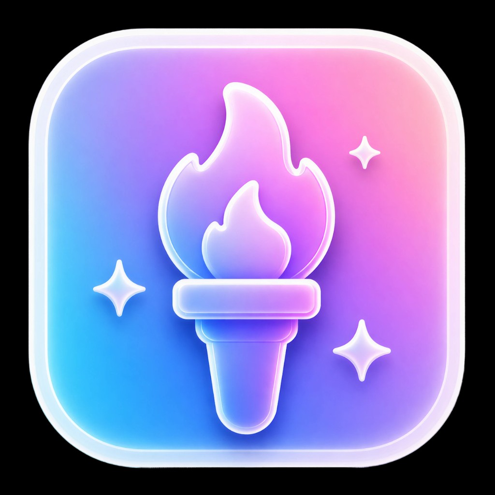

# torch-image-playground

<p align="center">
  
</p>

[](https://www.npmjs.com/package/torch-image-playground)
[](https://www.npmjs.com/package/torch-image-playground)

Expo-friendly bridge to Apple’s [Image Playground](https://developer.apple.com/documentation/imageplayground) on **iOS**: present the system sheet, let people generate an image, and receive a **local file path** when they’re done, or `null` if they bail. No custom image model required on your side.

## Platform support

**iOS only (18.2+).** Native code weak-links Apple’s **ImagePlayground** framework. There is no Android or web implementation.

The CocoaPods minimum is **iOS 18.2** so consumers stay aligned with APIs that only matter on that OS and newer. At runtime, **`isSupported()`** follows `ImagePlaygroundViewController.isAvailable` (OS + hardware). Unsupported devices report `false` instead of crashing.

If the native module is not present (non-iOS, not linked), the JS layer falls back gracefully: **`isSupported()`** behaves as false and **`launchAsync()`** resolves to `null`. You can still guard with `Platform.OS === "ios"` for clarity or tree-shaking.

**Expo Go:** not supported (custom native code). Use a **development build** ([`npx expo run:ios`](https://docs.expo.dev/develop/tools/#expo-run-commands), Xcode, or [EAS Build](https://docs.expo.dev/build/introduction/)).

## Install

```bash
npx expo install torch-image-playground
```

Then refresh native projects and run on a **physical device** with **iOS 18.2+** where Image Playground is available (see Apple’s docs for hardware).

Typical Expo flow:

- `npx expo prebuild` if you use [CNG](https://docs.expo.dev/workflow/prebuild/)
- `npx expo run:ios`

Pods usually install as part of the iOS build; run `npx pod-install` from the app root if you open Xcode directly or need to refresh pods.

For **bare React Native**, use `npm install torch-image-playground`, ensure [`expo` is installed](https://docs.expo.dev/bare/installing-expo-modules/), then `npx pod-install` from the app root.

## Usage

Full typings: [`src/TorchImagePlayground.types.ts`](src/TorchImagePlayground.types.ts) (`ImagePlaygroundParams`, `ImagePlaygroundConcepts`, etc.).

```ts
import TorchImagePlayground from "torch-image-playground";

if (!TorchImagePlayground.isSupported()) {
  // OS/hardware does not support Image Playground
  return;
}

try {
  const path = await TorchImagePlayground.launchAsync({
    concepts: { text: ["sunset", "mountains"] },
  });
  if (path) {
    // `path` is a filesystem path string (not a file:// URL)
  }
} catch (e) {
  // Thrown when native reports unsupported or presentation fails
}
```

**Concepts:** pass `{ text: string[] }` for keyword-style hints, or `{ content: string; title?: string }` for extraction-based guidance (see types).

## Example app

From the package repo:

```bash
cd example
npm install
npx expo prebuild --clean --platform ios
npx expo run:ios
```

Run the example on a **physical iPhone or iPad** with **iOS 18.2 or later** if you want the full Image Playground experience.

## License

MIT. See [LICENSE](./LICENSE).
